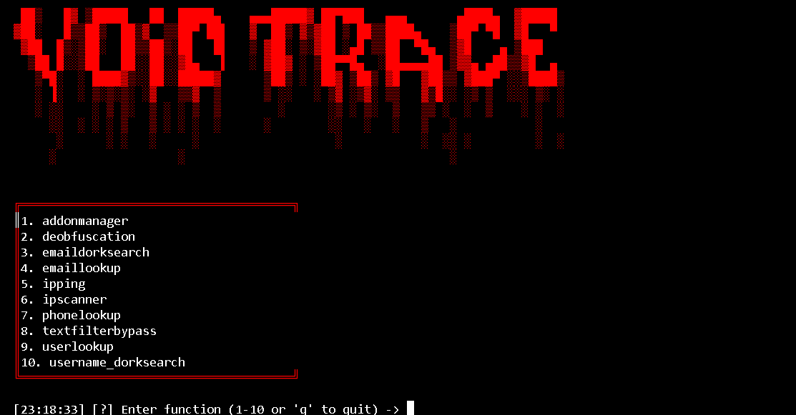
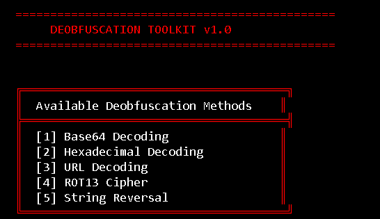
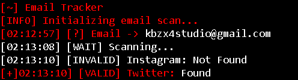

Void Trace

Void Trace is a modernized open-source intelligence (OSINT) and reconnaissance
tool (planned to be a framework in the future) written in Python.
It continues the evolution of the DevilEye project — redesigned for improved stability, modularity, and data depth.

---

---

Features

Phone Lookup – Analyze and validate phone numbers with carrier, region, and type detection.

Web Intelligence – Extract public information and metadata from websites.

Network Analysis – Perform connectivity and domain checks to reveal traceable network layers.

Enhanced CLI Interface – Colored output, ASCII banners, and clean command feedback.

Modular Design – Easily extendable for new OSINT sources and data types.

---

---

---

---
Installation

1. Clone the Repository

git clone https://github.com/kbzx3/void-trace.git
cd void-trace

2. Create a Virtual Environment (Optional)

python3 -m venv venv
# Windows
venv\Scripts\activate
# Linux/macOS
source venv/bin/activate

3. Install Dependencies

pip install -r requirements.txt

---

Usage

Run the main script to launch the toolkit:

python main.py

Void Trace will present a terminal-driven interface for lookups, traces, and data correlation.
Supported inputs include phone numbers, URLs, and general identifiers depending on the module invoked.

---

Addon Development

Developers can expand Void Trace by creating standalone modules.
Ensure each new module’s main function matches its filename — e.g. a function named reversesearch must reside in reversesearch.py.

---

Relation to DevilEye

Void Trace is the direct successor to DevilEye, built with modern libraries and extended capabilities.
It retains the OSINT foundation but adds a more stable architecture, cleaner visuals, and greater data reach.

Improvements include:

Better terminal and user interaction

Integrated parsing for phone and web data

Modular scripting support

Ongoing feature and performance updates

---

Updates

Void Trace receives continuous updates introducing:

New tracing modules and analysis tools

Performance and accuracy improvements

Broader data-source integration

Regular security patches

---

Contributing

Contributions are open to all.
Steps:

1. Fork the repository

2. Create a branch for your feature or fix

3. Submit a pull request

Ensure your code follows Python 3 standards and maintains module compatibility.

---

License

Void Trace is licensed under the GPL 3.0 License.
You are free to use, modify, and redistribute responsibly.

---

Disclaimer

This project is built for educational and ethical OSINT research only.
Unauthorized surveillance, intrusion, or misuse is strictly prohibited.
Developers hold no responsibility for improper or illegal use.

---
